# nostr-pos

Open, backendless retail POS protocol and reference app for Liquid settlement,
Lightning swaps, and Bolt Card payments.

This repository is organized as a small monorepo:

- `packages/nostr-pos-protocol-spec`: schemas, fixtures, and human protocol docs.
- `packages/nostr_pos`: Dart controller SDK ([README](packages/nostr_pos/README.md)).
- `apps/nostr_pos_cli`: CLI controller built on the Dart SDK ([README](apps/nostr_pos_cli/README.md)).
- `apps/pos-pwa`: static Svelte 5 + Vite cashier PWA.
- `infra`: local relay/Liquid/swap development scaffolding.

## Live demo: web cashier + Dart controller, side by side

Three controller commands take you from "nothing" to "terminal authorized and
ringing up sales".

```bash
# Terminal A: start the cashier PWA
npm install
npm run preview -w apps/pos-pwa -- --host 0.0.0.0 --port 4173

# Terminal B: controller
cd apps/nostr_pos_cli
dart pub get

# 1. Generate merchant + recovery keys; persist defaults.
dart run bin/nostr_pos.dart init --base-url 'http://localhost:4173/#/pos'

# 2. Publish the POS profile and print the URL the cashier opens.
dart run bin/nostr_pos.dart serve-pos

# 3. After opening the URL on the cashier, copy the displayed pairing code
#    (e.g. 4F7G-YJDP) and authorize the terminal:
dart run bin/nostr_pos.dart pair-terminal --pairing-code 4F7G-YJDP
```

`init` writes `.nostr-pos/profile.json` (gitignored) with the merchant key,
recovery key, POS id, relays, and store path. `serve-pos` and `pair-terminal`
both read those defaults — no flag soup. The cashier picks up the
authorization from relays automatically and unlocks the keypad. Total: two
human steps and three commands.

For the full mainnet runbook (Liquid, Lightning, recovery), see
[`docs/mainnet-e2e-test.md`](docs/mainnet-e2e-test.md).

## End-to-end workflow

```mermaid
flowchart TD
    Start([Merchant has nothing]) --> Init["controller: init<br/>generate merchant + recovery keys<br/>write .nostr-pos/profile.json"]
    Init --> Serve["controller: serve-pos<br/>build + sign POS profile (kind 30380)<br/>publish to relays<br/>print naddr URL"]
    Serve --> OpenPwa["cashier: open URL<br/>browser loads PWA"]
    OpenPwa --> HasProfile{"profile available<br/>via naddr?"}
    HasProfile -- "no" --> ManualActivate["cashier: open /activate<br/>generate terminal key<br/>show pairing code"]
    HasProfile -- "yes" --> AutoActivate["cashier: derive terminal key<br/>publish pairing announcement (kind 30383)<br/>show pairing code"]
    ManualActivate --> Announce["cashier publishes pairing<br/>announcement (kind 30383)"]
    AutoActivate --> Announce
    Announce --> Pair["controller: pair-terminal --pairing-code XXXX-XXXX<br/>poll relays for kind 30383"]
    Pair --> Found{"announcement<br/>discovered?"}
    Found -- "no, timeout" --> RetryPair["controller exits 66<br/>operator retries"]
    RetryPair --> Pair
    Found -- "yes" --> Authorize["controller builds terminal authorization<br/>(kind 30381)<br/>NIP-44 encrypts CT descriptor to terminal pubkey<br/>signs with merchant key"]
    Authorize --> Publish["controller publishes auth<br/>2-of-N relay quorum"]
    Publish --> CashierUnlock["cashier polls for kind 30381<br/>verifies merchant signature<br/>decrypts CT descriptor"]
    CashierUnlock --> Live(["Terminal live<br/>keypad unlocked"])

    Live --> NewSale["cashier rings sale<br/>kind 9380 sale-created (encrypted)"]
    NewSale --> ChooseMethod{"payment<br/>method?"}

    ChooseMethod -- "Liquid" --> LiquidAddr["cashier derives next address<br/>from terminal CT branch"]
    LiquidAddr --> CustomerPaysL["customer pays Liquid invoice"]
    CustomerPaysL --> LiquidWatch["cashier polls Esplora<br/>unblinds candidate output"]
    LiquidWatch --> LiquidConfirm{"valid mempool<br/>or confirmed?"}
    LiquidConfirm -- "no" --> Wait["wait / retry"]
    Wait --> LiquidWatch
    LiquidConfirm -- "yes" --> Settled

    ChooseMethod -- "Lightning (Boltz reverse swap)" --> LightInvoice["cashier creates Boltz BTC→L-BTC swap<br/>generates preimage + claim keypair"]
    LightInvoice --> Backup["cashier publishes encrypted<br/>swap recovery backup<br/>kind 9381, gift-wrapped to recovery key"]
    Backup --> Quorum{"backup reached<br/>≥2 relays?"}
    Quorum -- "no" --> Abort["abort sale<br/>show explicit error"]
    Quorum -- "yes" --> ShowQR["cashier shows<br/>verified Bolt11 QR"]
    ShowQR --> CustomerPaysLn["customer pays Lightning"]
    CustomerPaysLn --> BoltzLockup["Boltz locks L-BTC<br/>cashier sees lockup tx"]
    BoltzLockup --> Claim["cashier builds + broadcasts<br/>Liquid claim transaction"]
    Claim --> Settled

    ChooseMethod -- "Bolt Card" --> BoltCard["cashier presents NFC tap<br/>same Boltz lockup-claim path"]
    BoltCard --> Settled([" "])

    Settled["payment-status (kind 9382)<br/>+ receipt (kind 9383)<br/>encrypted, replicated to relays"] --> NextSale{"another<br/>sale?"}
    NextSale -- "yes" --> NewSale
    NextSale -- "no, terminal lost / compromised" --> Recovery

    Recovery["controller: recover-swaps<br/>--merchant-recovery-privkey ...<br/>fetch + decrypt kind 9381 backups"] --> RecoveryAction{"backup<br/>state?"}
    RecoveryAction -- "claim_tx_hex prepared" --> RebroadcastClaim["controller rebroadcasts<br/>via Liquid Esplora"]
    RecoveryAction -- "needs claim" --> BuildClaim["controller polls Boltz status<br/>builds + broadcasts claim"]
    RecoveryAction -- "expired" --> AuditExpired["audit only<br/>swap timed out before payment"]
    RebroadcastClaim --> RecoveryDone(["funds recovered to<br/>merchant Liquid address"])
    BuildClaim --> RecoveryDone
    AuditExpired --> RecoveryDone

    NextSale -- "no, revoke a terminal" --> Revoke["controller: revoke-terminal --terminal-pubkey ...<br/>publish kind 30382"]
    Revoke --> CashierLock(["cashier reads revocation<br/>locks keypad"])
```



## Smoke commands

```bash
npm run protocol:check
npm run check
npm run test -w apps/pos-pwa
npm run build -w apps/pos-pwa
npm run audit:pwa
cd packages/nostr_pos && dart analyze && dart test
cd apps/nostr_pos_cli && dart analyze && dart test
```

Relay smoke:

```bash
npm run relay:smoke
```

Controller publish smoke (no profile, deterministic merchant key):

```bash
cd apps/nostr_pos_cli
tmp=$(mktemp -d)
dart run bin/nostr_pos.dart create-pos \
  --merchant-privkey 0000000000000000000000000000000000000000000000000000000000000001 \
  --pos-id smoke-$(date +%s) \
  --store "$tmp/events.jsonl"
dart run bin/nostr_pos.dart publish-events --store "$tmp/events.jsonl" --limit 1
```

## Recovery operations

List encrypted swap recovery records from a local event store, or merge relay
records addressed to the merchant recovery key:

```bash
cd apps/nostr_pos_cli
dart run bin/nostr_pos.dart recover-swaps \
  --store .nostr-pos/events.jsonl \
  --relays wss://no.str.cr,wss://relay.primal.net,wss://nos.lol \
  --merchant-recovery-privkey <merchant-recovery-private-key-hex>
```

If a terminal prepared and published `claim_tx_hex` before dying, the controller
can broadcast that prepared claim through a Liquid Esplora backend:

```bash
dart run bin/nostr_pos.dart recover-swaps \
  --store .nostr-pos/events.jsonl \
  --relays wss://no.str.cr,wss://relay.primal.net,wss://nos.lol \
  --merchant-recovery-privkey <merchant-recovery-private-key-hex> \
  --broadcast-prepared \
  --liquid-api https://liquid.bullbitcoin.com/api
```

## Design tradeoffs

This project has an unusual shape: no backend, no merchant servers, no central
database, a browser-resident cashier, and funds that settle on Liquid and
Lightning. A few deliberate compromises made that possible. They are documented
here so anyone forking or operating the protocol understands what was bought
and what was paid.

### Terminals receive a watch-only CT descriptor

Each terminal authorization carries a **terminal-specific confidential
transaction (CT) descriptor** — a single branch off the merchant's POS root,
with no spend key and no unblinding key for other branches.

Bought:

- Terminals derive fresh Liquid addresses **offline, locally, with no round
  trip** to the merchant or a coordinator. Address derivation is `lwk_wasm` in
  the browser, indexed by the terminal's own `next_address_index`.
- The merchant controller reconciles by scanning the authorized branches it
  already knows about. No global address registry.
- A compromised terminal can never spend — it holds no spend key.

Paid:

- A compromised terminal can enumerate every address on its branch and
  unblind every payment sent to that branch, past and future. The merchant
  transaction graph for that terminal branch leaks on device compromise.
- The descriptor ships inside an encrypted kind-30381 terminal authorization
  event. Relays see an opaque payload, but anyone who steals the device after
  unlock sees the CT descriptor plaintext. Mitigation: per-terminal branches
  so the blast radius is one terminal, plus merchant revocation.

### Standard reverse swaps, not covenant claims (v1)

Lightning settlement uses Boltz reverse swaps in `claim_mode: "standard"`.
The terminal generates the preimage and claim keypair and broadcasts the
claim transaction itself.

Bought: works with vanilla Boltz today, no protocol extension needed, ship in
weeks instead of quarters.

Paid: between preimage reveal and claim broadcast, a compromised terminal
can redirect claim output to an attacker address. Bounded by
`max_invoice_sat` (default 100k sats / ~$60) and `daily_volume_sat`
(default 20M sats / ~$12k), both per-terminal and revocable instantly.
Covenant mode is a v1.1 toggle — schemas already carry `claim_mode`, so the
flip does not require a protocol bump.

### Fast confirmation mode (0-conf) is the default

Retail sales mark paid on **valid mempool detection**, not on a confirmed
block.

Bought: sub-second "paid" feedback on the cashier screen. Lines move.

Paid: exposure to RBF / double-spend between mempool accept and block
inclusion. Acceptable because (a) Liquid block times are ~1 minute with
federated functionaries, (b) pilot ticket sizes are small, and (c) the
cashier can toggle Strict or Conservative mode per-POS if risk profile
demands it.

### PIN is optional, and that has a named cost

With PIN: master encryption key is derived from PIN and never stored.
Device compromise without PIN knowledge leaves IndexedDB contents encrypted.

Without PIN: a non-extractable `CryptoKey` wraps the master key. The browser
will not let JS read it, but any code running in the origin can *use* it.

Bought: one-tap terminal startup. No password prompt per shift change.

Paid: device compromise without PIN ≈ full terminal compromise. Documented
explicitly in Settings → Advanced. Choice is per-POS.

### Local-first IndexedDB, relays as replication

IndexedDB is the **source of truth**. Relays hold signed copies for
recovery, cross-device sync, and encrypted backups — they are not the
authority.

Bought: terminal keeps taking sales during relay outage. Refreshing the
cashier screen renders transactions from local state in milliseconds, then
reconciles against relays in the background. Nothing blocks on a network
round trip that isn't a payment-path call.

Paid: no central audit log, no "server knows best" fallback. Relays can
drop, reorder, or delay events. Mitigated by multi-relay replication
(default 3, 2-of-N quorum for recovery), latest-timestamp idempotent state,
and oldest-first application on backup import so a late-arriving stale
backup cannot stomp newer claim state.

### Single-tab single-writer, enforced in the browser

A `BroadcastChannel` keyed on the terminal pubkey elects a single live tab.
Other tabs downgrade to read-only with a banner.

Bought: no duplicate address index assignment, no duplicate sale IDs, no
split-brain between two tabs of the same terminal.

Paid: users who open a second tab (accidentally or otherwise) hit a
read-only screen until they close it. The banner is explicit, but it is
still a UX papercut on shared devices.

### Encrypted recovery backups go through Nostr relays

Every settlement-critical artifact — swap claim keys, preimages, prepared
claim tx hex, sale state — is encrypted (NIP-44 or gift wrap) and published
to relays. Recovery is a one-command operation against the merchant
recovery key.

Bought: merchant runs zero infrastructure. A destroyed terminal is
recoverable from any device that holds the recovery key and can reach two
of the three configured relays.

Paid: relays see the envelope. They learn that recipient X received a
payload of Y bytes at time Z — content is sealed, metadata is not.
Acceptable because the protocol assumes relays are untrusted for
confidentiality of envelope timing.

### No merchant backend

There is no merchant server, ever. The controller is a Dart CLI the
merchant runs from a laptop (or, eventually, a Bull Wallet integration).
Terminals talk to relays and to Liquid/Boltz directly.

Bought: trivial to self-host, trivial to audit, no API to keep patched, no
DB to back up, no user accounts to breach.

Paid: operational knobs that typically live in a dashboard (activation
approval, terminal revocation, recovery broadcast) live in a CLI. Acceptable
for the pilot merchant profile — senior operator, small fleet — but this is
the single biggest usability tradeoff in v1. Bull Wallet integration is the
path forward.
